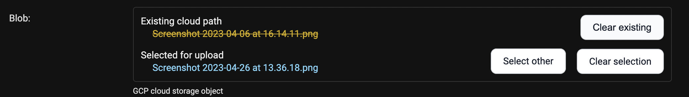
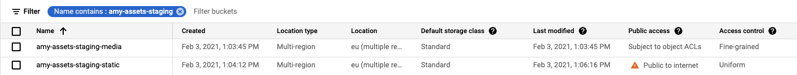

# Storage

This module provides helpers for working with
[Google Cloud Storage](https://cloud.google.com/storage/) (GCS), including:

1. A Django `Storage` class allowing Django's `FileField` to use GCS as a storage backend.
   This incorporates the GCS-specific parts of
   [django-storages](https://django-storages.readthedocs.io/en/latest/).
2. A `BlobField` with an associated widget to facilitate direct uploads and provide more
   powerful ways of working with GCS features, including metadata and revisions.



_The widget provides a better user experience for blankable and overwriting options._

## Installation and authentication

First, follow the instructions to [install](getting-started.md),
[authenticate](authentication/index.md), and (if necessary)
[set your project](projects.md).

## Create bucket(s)

This library does not create buckets for you: infrastructure operations should be kept
separate and dealt with using tools built for the purpose, like Terraform.

If you are setting up for the first time and do not want to get into
infrastructure-as-code, manually create two buckets in your project:

- One with **object-level** permissions for **media** files.
- One with **uniform, public** permissions for **static** files.

!!! tip

    Having two buckets like this makes it easier to configure which files are public and which
    are not. Plus, you can serve your static files much more efficiently —
    [publicly shared files are cached in Google's cloud CDN](https://cloud.google.com/appengine/docs/standard/go/serving-static-files#serving_files_from),
    so they are lightning quick for users to download, and egress costs you almost nothing.

!!! tip

    To make setup easy and consistent (and to remember which bucket is which!), we always use
    kebab-case bucket names in the form:

    ```
    <app>-<purpose>-<environment>-<media-or-static>
    ```

    The buckets for a staging environment in one of our apps look like this:

    

## Set up media and static storage

The most common types of storage are for media and static files, using the storage backend.
We provide a custom storage class for each, plumbed in via Django's `STORAGES` setting.

In your `settings.py` file, do:

```python
STORAGES = {
    "default": {
        "BACKEND": "django_gcp.storage.GoogleCloudMediaStorage",
        "OPTIONS": {
            "bucket_name": "app-assets-environment-media",  # Or whatever name you chose
        },
    },
    "staticfiles": {
        "BACKEND": "django_gcp.storage.GoogleCloudStaticStorage",
        "OPTIONS": {
            "bucket_name": "app-assets-environment-static",  # Or whatever name you chose
        },
    },
}

# Point the urls to the store locations
#   You could customise the base URLs later with your own cdn, eg https://static.you.com
#   But that's only if you feel like being ultra fancy
MEDIA_URL = f"https://storage.googleapis.com/{STORAGES['default']['OPTIONS']['bucket_name']}/"
MEDIA_ROOT = "/media/"
STATIC_URL = f"https://storage.googleapis.com/{STORAGES['staticfiles']['OPTIONS']['bucket_name']}/"
STATIC_ROOT = "/static/"
```

!!! note

    The `"default"` alias is what Django reads for `FileField` storage, and `"staticfiles"` is
    what `manage.py collectstatic` reads for static uploads. These alias names are fixed by
    Django convention; extra stores can use any name you like.

## Default and extra stores

Any number of extra stores can be added, each corresponding to a different bucket in GCS. Just
add additional entries to the `STORAGES` dict — each top-level alias becomes a `store_key` you
can use on a `BlobField` or pass to `GoogleCloudStorage`:

```python
STORAGES = {
    "default": {
        "BACKEND": "django_gcp.storage.GoogleCloudMediaStorage",
        "OPTIONS": {"bucket_name": "app-assets-environment-media"},
    },
    "staticfiles": {
        "BACKEND": "django_gcp.storage.GoogleCloudStaticStorage",
        "OPTIONS": {"bucket_name": "app-assets-environment-static"},
    },
    "my-fun-store": {
        "BACKEND": "django_gcp.storage.GoogleCloudStorage",
        "OPTIONS": {"bucket_name": "all-the-fun-datafiles"},
    },
    "my-sad-store": {
        "BACKEND": "django_gcp.storage.GoogleCloudStorage",
        "OPTIONS": {"bucket_name": "all-the-sad-datafiles"},
    },
}
```

Then reference an extra store from a `BlobField` via its alias:

```python
blob = BlobField(store_key="my-fun-store", get_destination_path=...)
```

With the `STORAGES` setting in place, `default_storage` is your Google Cloud media storage:

```python
>>> from django.core.files.storage import default_storage
>>> print(default_storage.__class__)
<class 'django_gcp.storage.GoogleCloudMediaStorage'>
```

This way, if you define a new `FileField`, it will use that storage bucket:

```python
>>> from django.db import models
>>> class MyModel(models.Model):
...     my_file_field = models.FileField(upload_to="pdfs")
...     my_image_field = models.ImageField(upload_to="photos")
```

## BlobField storage

The benefit of a `BlobField` is that you can upload objects directly to the cloud. This allows
you to accept uploads of files larger than 32 MB while on request-size-limited services like
Cloud Run.

To enable this and other advanced features (like caching of metadata and blob version
tracking), `BlobField`s intentionally do not maintain the `FileField` API. Under the hood, a
`BlobField` is actually a `JSONField`, allowing properties other than just the blob name to be
stored in the database.

We will flesh out these instructions later (pull requests accepted!), but in the meantime, see
the [example implementation](https://github.com/octue/django-gcp/blob/main/tests/server/example/models.py).
You will need to:

1. Add a `django_gcp.storage.fields.BlobField` field to a model.
2. Define a `get_destination_path` callback to generate the eventual name of the blob in the
   store.

!!! tip

    On upload, blobs are always ingressed to a temporary location, then moved to their eventual
    destination on save of the model. Two steps (ingress then rename) may seem unnecessary, but
    this allows the eventual destination to use the other model fields. It also avoids problems
    where you require deterministic object names: where object versioning or retention is
    enabled on your bucket, an unrelated failure in the model `save()` process would otherwise
    prevent future uploads to the same pathname.

!!! warning

    Migrating from an existing `FileField` to a `BlobField` is possible but a bit tricky. We
    provide an example of how to do that migration in the
    [example server model](https://github.com/octue/django-gcp/blob/main/tests/server/example/models.py)
    (see the instructions in the model and the corresponding migration files).

## FileField storage

The storage classes work as a standard drop-in storage backend. Standard file access options
are available and work as expected:

```python
>>> default_storage.exists("storage_test")
False
>>> file = default_storage.open("storage_test", "w")
>>> file.write("storage contents")
>>> file.close()

>>> default_storage.exists("storage_test")
True
>>> file = default_storage.open("storage_test", "r")
>>> file.read()
'storage contents'
>>> file.close()

>>> default_storage.delete("storage_test")
>>> default_storage.exists("storage_test")
False
```

The same applies to models. An object without a file has limited functionality:

```python
>>> obj1 = MyModel()
>>> obj1.my_file_field
<FieldFile: None>
>>> obj1.my_file_field.size
Traceback (most recent call last):
...
ValueError: The 'my_file_field' attribute has no file associated with it.
```

Saving a file enables full functionality:

```python
>>> obj1.my_file_field.save("django_test.txt", ContentFile("content"))
>>> obj1.my_file_field
<FieldFile: tests/django_test.txt>
>>> obj1.my_file_field.size
7
>>> obj1.my_file_field.read()
'content'
```

Files can be read a little at a time, if necessary:

```python
>>> obj1.my_file_field.open()
>>> obj1.my_file_field.read(3)
'con'
>>> obj1.my_file_field.read()
'tent'
>>> "-".join(obj1.my_file_field.chunks(chunk_size=2))
'co-nt-en-t'
```

Saving another file with the same name appends extra characters (see the `file_overwrite`
option below):

```python
>>> obj2 = MyModel()
>>> obj2.my_file_field.save("django_test.txt", ContentFile("more content"))
>>> obj2.my_file_field
<FieldFile: tests/django_test_.txt>
>>> obj2.my_file_field.size
12
```

## Storage settings options

Each store can be set up with different options, passed via the `OPTIONS` dict for that alias
in the `STORAGES` setting. For example, to set the media storage up so that files go to a
location other than the root of the bucket:

```python
STORAGES = {
    "default": {
        "BACKEND": "django_gcp.storage.GoogleCloudMediaStorage",
        "OPTIONS": {
            "bucket_name": "app-assets-environment-media",
            "location": "not/the/bucket/root/",
            # ... and whatever other options you want
        },
    },
    # ... other aliases ...
}
```

The full range of options (and their defaults) is as follows.

### `gzip`

Type: `boolean`

Default: `False`

Whether to enable gzipping of the content types specified by `gzip_content_types`.

### `gzip_content_types`

Type: `tuple`

Default: `("text/css", "text/javascript", "application/javascript", "application/x-javascript", "image/svg+xml")`

Content types which will be gzipped when `gzip` is `True`.

### `default_acl`

Type: `string` or `None`

Default: `None`

ACL used when creating a new blob, from the
[list of predefined ACLs](https://cloud.google.com/storage/docs/access-control/lists#predefined-acl).
(A "JSON API" ACL is preferred, but an "XML API/gsutil" ACL will be translated.)

For most cases, the blob needs the `publicRead` ACL for the file to be viewable. If
`default_acl` is not set, the blob has the default permissions set by the bucket.

`publicRead` files return a public, non-expiring URL. All other files return a signed
(expiring) URL. ACL options are: `projectPrivate`, `bucketOwnerRead`,
`bucketOwnerFullControl`, `private`, `authenticatedRead`, `publicRead`, `publicReadWrite`.

!!! note

    `default_acl` must be set to `publicRead` to return a public URL, even if you set the
    bucket to public or set the file permissions directly in GCS to public.

!!! note

    When using this setting, make sure you have **fine-grained** access control enabled on
    your bucket (as opposed to **uniform** access control), or file uploads will return HTTP
    400. If you already have a bucket with uniform access control set to public read, keep
    `default_acl` as `None` and set `querystring_auth` to `False`.

### `querystring_auth`

Type: `boolean`

Default: `True`

If set to `False`, forces URLs not to be signed. This setting is useful if your bucket is
configured with uniform access control and public read: in that case, set
`querystring_auth = False` and `default_acl = None`.

### `file_overwrite`

Type: `boolean`

Default: `True`

By default, files with the same name overwrite each other. Set this to `False` to have extra
characters appended to new files with duplicate names.

### `max_memory_size`

Type: `integer`

Default: `0` (do not roll over)

The maximum amount of memory a returned file can take up (in bytes) before being rolled over
into a temporary file on disk.

### `blob_chunk_size`

Type: `integer` or `None`

Default: `None`

The size of blob chunks that are sent via resumable upload. If this is not set, the generated
request must fit in memory. Recommended if you are going to be uploading large files.

!!! note

    This must be a multiple of 256 KB (1024 × 256 bytes).

### `object_parameters`

Type: `dict`

Default: `{}`

Dictionary of key-value pairs mapping from blob property name to value. Use this to set
parameters on **all** objects. To set them on a per-object basis, subclass the backend and
override `GoogleCloudStorage.get_object_parameters`.

The valid property names are: `acl`, `cache_control`, `content_disposition`,
`content_encoding`, `content_language`, `content_type`, `metadata`, `storage_class`.

If not set, the `content_type` property will be guessed. If set, `acl` overrides
`default_acl`.

!!! warning

    Do not set `name`. It is set automatically based on the filename.

### `custom_endpoint`

Type: `string` or `None`

Default: `None`

Sets a [custom endpoint](https://cloud.google.com/storage/docs/request-endpoints) used instead
of `https://storage.googleapis.com` when generating URLs for files.

### `location`

Type: `string`

Default: `""`

Subdirectory in which the files will be stored. Defaults to the root of the bucket.

### `expiration`

Type: `datetime.timedelta`, `datetime.datetime`, or `integer` (seconds since epoch)

Default: `timedelta(seconds=86400)`

The time a generated URL is valid before expiration; the default is one day. Public files
return a URL that does not expire. Files are signed by the credentials provided during
[authentication](authentication/index.md).

The value is handled by the underlying
[Google library](https://googlecloudplatform.github.io/google-cloud-python/latest/storage/blobs.html#google.cloud.storage.blob.Blob.generate_signed_url),
which supports `timedelta`, `datetime`, or integer seconds since epoch.

## Cleaning up temporary uploads

When direct uploads are ingressed to a temporary location but the corresponding model save
fails, an orphaned upload is left behind. The `cleanup_tmp_files` management command lists
temporary blobs older than 24 hours in a given store, and deletes them if passed the
`--delete` flag:

```bash
python manage.py cleanup_tmp_files default --delete
```

## Configuration in 0.24 and below

Prior to `django-gcp` 0.25, storage was configured via Django's deprecated
`DEFAULT_FILE_STORAGE` and `STATICFILES_STORAGE` settings, with options held in three separate
dicts: `GCP_STORAGE_MEDIA`, `GCP_STORAGE_STATIC`, and `GCP_STORAGE_EXTRA_STORES`. `BlobField`
used `store_key="media"` and `store_key="static"` instead of `"default"`/`"staticfiles"`.

That configuration looked like this:

```python
# Set the default storage (for media files)
DEFAULT_FILE_STORAGE = "django_gcp.storage.GoogleCloudMediaStorage"
GCP_STORAGE_MEDIA = {
    "bucket_name": "app-assets-environment-media"  # Or whatever name you chose
}

# Set the static file storage
#   This allows `manage.py collectstatic` to automatically upload your static files
STATICFILES_STORAGE = "django_gcp.storage.GoogleCloudStaticStorage"
GCP_STORAGE_STATIC = {
    "bucket_name": "app-assets-environment-static"  # Or whatever name you chose
}

GCP_STORAGE_EXTRA_STORES = {
    "my_fun_store_key": {"bucket_name": "all-the-fun-datafiles"},
    "my_sad_store_key": {"bucket_name": "all-the-sad-datafiles"},
}

MEDIA_URL = f"https://storage.googleapis.com/{GCP_STORAGE_MEDIA['bucket_name']}/"
MEDIA_ROOT = "/media/"
STATIC_URL = f"https://storage.googleapis.com/{GCP_STORAGE_STATIC['bucket_name']}/"
STATIC_ROOT = "/static/"
```

To migrate to 0.25+:

1. Replace the legacy settings above with a single `STORAGES` dict (see
   [Set up media and static storage](#set-up-media-and-static-storage)). Each former
   extra-stores entry becomes a top-level alias under `STORAGES` — there is no separate
   "extra" wrapper anymore.
2. In every model, rename `BlobField(store_key="media")` to `BlobField(store_key="default")`
   and `store_key="static"` to `store_key="staticfiles"`. Any custom store keys keep their
   names.
3. Run `python manage.py makemigrations` to capture the `store_key` change as an `AlterField`
   migration for each affected `BlobField`.
4. If you use the `manage.py cleanup_tmp_files` management command, update the positional
   `store_key` argument to the new alias name.
